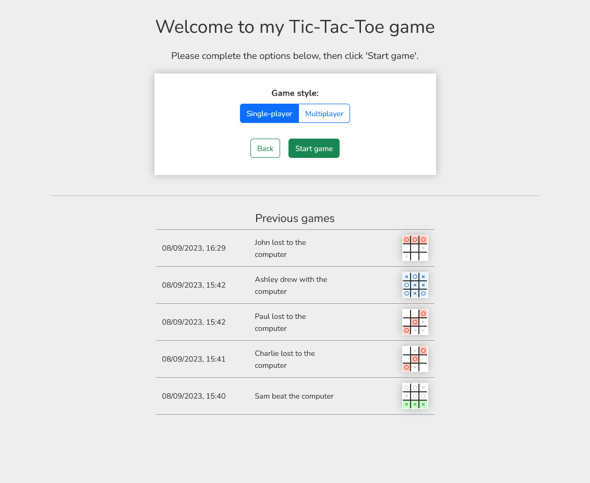

## Welcome to my Tic-Tac-Toe game

This is a game built with a Laravel backend and React UI frontend.

Please follow the instructions below to run the game.

### Installation

In your local development environment, clone the repository by running the git command below:

```
git clone https://github.com/chant9/tic-tac-toe.git
```

## Installation

Please run all the commands below from the project root directory.

### Installing Laravel

Run the composer command below.

```
composer install
```

If an error occurs with the composer install, you may need to run the command below.

```
composer install --ignore-platform-reqs
```

### Setting up the environment file

Copy of the example .env file to be the .env file used with the command below.

```
mv .env.example .env
```

The example environment file may need modifying for your database details, it will be setup with the standard details below.

```
DB_CONNECTION=mysql
DB_HOST=127.0.0.1
DB_PORT=3306
DB_DATABASE=tictactoe
DB_USERNAME=root
DB_PASSWORD=
```

### Installing React UI

Run the npm command below.

```
npm install
```

If an error occurs with the npm install, you may need to run the command below.

```
npm install --legacy-peer-deps
```

You can then compile the application by running the command below.

```
npm run build
```

### Setting up the database

Run the php artisan command below, if there is an error connecting to the database, please verify the details in the environment file.

```
php artisan migrate
```

### Running the site server

Run the php artisan command below to run the site, and it should output the site URL. The site URL will likely be http://127.0.0.1:8000/

```
php artisan serve
```

## Playing the game

Playing the game should be easy, you'll be taken through the game setup in steps where you enter your name, choose your symbol for the game, then confirm if you want to play against the computer or a friend.

After completing the setup the game board will show, and it will say at the top who's turn it is to pick a move. If you are playing against the computer, the computer might made made the first move, so a symbol will already be on the board.

Once the game is complete, it will confirm the result and give options to restart the game, which starts a new game with the same game and player setup. Or you can start a new game and go through the game and player setup again.

Once games have been completed and saved to the database, previous games will show at the bottom of the page, confirming the time, the result and how the board ended that can be zoom on hover.

### Game screenshots

<p style="text-align: center">
  
  
  
  
  
  
  
  
</p>
